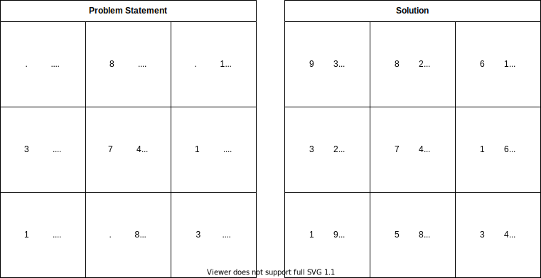

# sudoku-solver


Given a partially filled 9×9 2D array grid[9][9], 
the goal is to assign digits (from 1 to 9) to the empty cells so that every row, column, and subgrid of size 3×3 contains exactly one instance of the digits from 1 to 9. 




We will solve this using backtracking
```
1. If there is no empty cell in the matrix M: return true
2. Let (r, c) be an empty cell in the matrix M
3. For i from 1 to 9:
    If i is not present in the row r, in column c, and the 3x3
    submatrix of (r, c):
        a) M(r, c) = i 
        b) recursively try fill in remaining empty cells
        c) If recursion was successful:
             return true
           Else
             M(r, c) = 0
4. return false
```

So, we need to find for a 9x1 row and 1x9 column and a 3x3 submatrix, if a value is set or not
For this we can use bit manipulation

Consider the first row of the input matrix
We can store the digits into the following way
```
digits: 9 8 7 6 5 4 3 2 1
bit:    0 1 1 0 0 1 0 0 1
```
For the first column of the input matrix, we can store the digit in the following way
```
digits: 9 8 7 6 5 4 3 2 1
bit:    0 0 0 1 1 0 1 1 1
```
For the first submatrix of 3x3, we can store the digits in the following way
```
digits: 9 8 7 6 5 4 3 2 1
bit:    0 1 1 1 1 1 0 0 0
```
So we have 9 numbers (array) for rows, 9 numbers(array) for columns, and 9 numbers(array) for the 3x3 matrices

At step 3 above, to find if the digit is not in the row, col or 3x3 sub-matrix, we need to check the following expression
```
digitBit = 1 << (i-1)
(rowBits[r] & digitBit) && (colBits[c] & digitBit) && (subMatrixBits[3 * r/3 + c/3] & digitBit) 
```

If the above condition is true, we just set the bit for the digit to 1 in the arrays using
```
rowsBits[r] |= (1 << (i - 1))
colBits[c] |= (1 << (i - 1))
subMatrixBits[3 * r/3 + c/3] |= (1 << (i - 1))
```

If the recursion was unsuccessful, we need to roll back, we can simply un-set the values as
```
rowsBits[r] &= ~(1 << (i - 1))
colBits[c] &= ~(1 << (i - 1))
subMatrixBits[3 * r/3 + c/3] &= ~(1 << (i - 1))
```

### Complexity Analysis
For every unassigned index, there are 9 possible options so the time complexity is O(9^n). 
The time complexity remains the same but there will be some early pruning so the time taken will be much less than the naive algorithm but the upper bound time complexity remains the same.

Space Complexity using bit manipulation: O(3*9).
